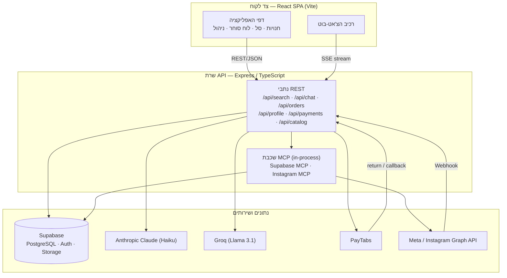
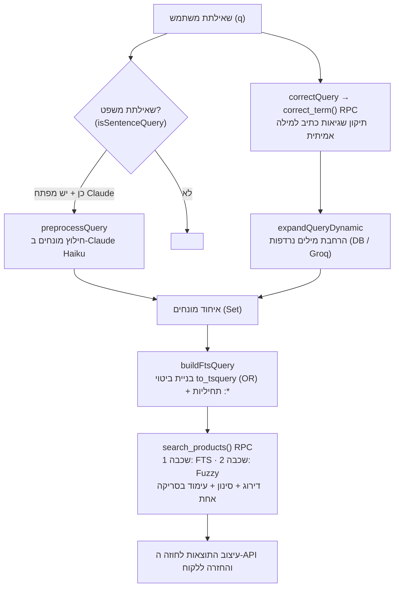
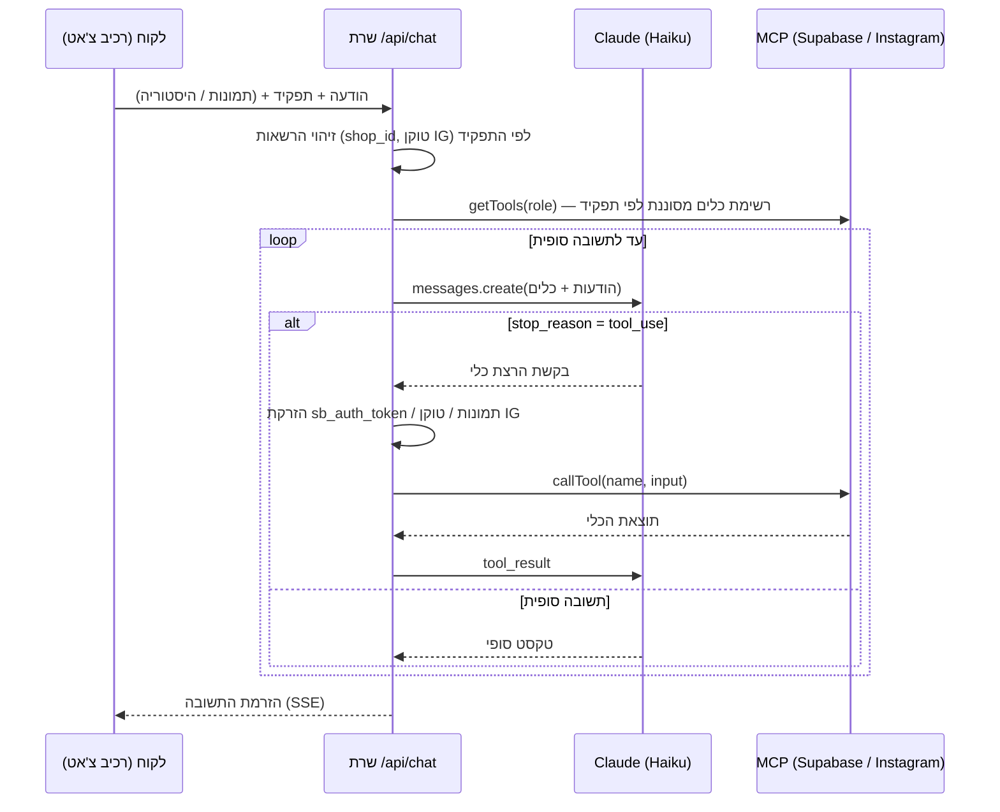
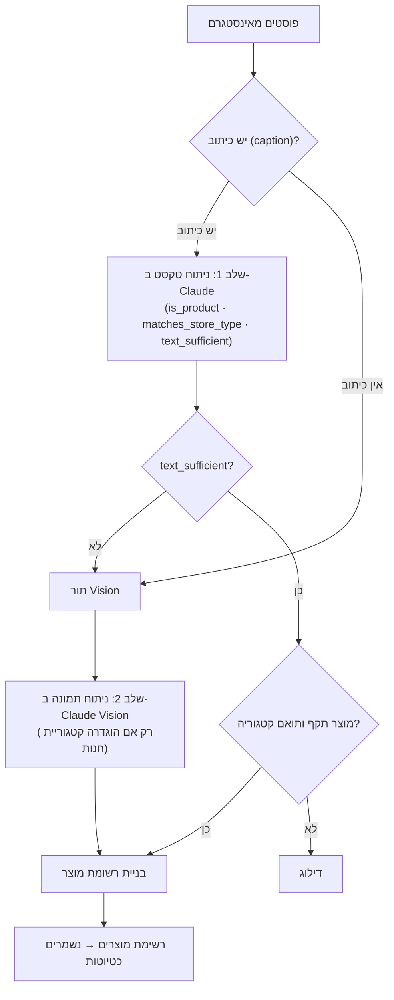

# פרק ב': תיאור פתרון המימוש (Implementation)

> פרק זה מתאר כיצד מומש הפתרון בפועל, בהמשך לתיאור המערכת כ"קופסה שחורה" שהוצג קודם.
> כל הנאמר כאן מבוסס על קוד המקור הקיים בפרויקט בלבד. בכוונה תחילה **אין** בפרק זה כל
> התייחסות למודול הלוגיסטיקה (קיבוץ משלוחים, תכנון מסלולים, סידור נקודות איסוף/מסירה,
> שיבוץ שליחים או אומדן נפח לאיסוף) — מודול זה מתואר בנפרד ואינו בתחום פרק זה.

---

## ב.1 מבוא

מערכת Souq Link מומשה כאפליקציית רשת מסוג **Single-Page Application (SPA)** הנשענת על שרת
**API** יחיד ועל פלטפורמת **Backend-as-a-Service**. צד הלקוח נכתב ב-React ומתקשר עם שרת
Express דרך ממשק REST; השרת, בתורו, ניגש לבסיס הנתונים, לשירותי הבינה המלאכותית ולשירותים
חיצוניים (תשלומים, רשתות חברתיות). מאפיין מרכזי של המימוש הוא שילוב מודלי שפה גדולים (LLM)
בכמה נקודות בזרימת הנתונים — בחיפוש, בצ'אט-בוט החכם ובייבוא מוצרים — לצד לוגיקה דטרמיניסטית
הממומשת בקוד וב-SQL. פרק זה מפרט את הטכנולוגיות, את חלוקת המערכת למודולים, את התכנון ברמה
הגבוהה, את תרשימי הזרימה של המודולים העיקריים, ואת האלגוריתמים שנעשה בהם שימוש — תוך הבחנה
בין אלגוריתמים מוכרים (עם קרדיט וביבליוגרפיה) לבין לוגיקה ייעודית שפותחה במסגרת הפרויקט.

---

## ב.2 הטכנולוגיות שבהן נעשה שימוש ותפקיד כל אחת

הטבלאות הבאות מתבססות על קובץ התלויות `package.json` ועל השימוש בפועל בקוד.

### ב.2.1 צד לקוח (Frontend)

| טכנולוגיה | תפקיד במערכת |
|---|---|
| **React 18** | ספריית ה-UI המרכזית; בניית כל הממשקים (חנויות, סל קניות, לוח מחוונים לסוחר, דפי ניהול). |
| **Vite 6** | כלי הבנייה ושרת הפיתוח של צד הלקוח. |
| **TailwindCSS 4** | מערכת עיצוב מבוססת utility-classes לכל סגנון הממשק. |
| **react-router-dom 7** | ניתוב צד-לקוח בין דפי האפליקציה. |
| **Leaflet** | הצגת מפות ובחירת מיקום גאוגרפי (רכיב `LocationPicker`, בחירת מיקום חנות). |
| **lucide-react** | ספריית אייקונים. |
| **nprogress** | סרגל התקדמות עליון בזמן מעברי דפים/בקשות. |
| **react-markdown + remark-gfm** | רינדור תשובות הצ'אט-בוט המגיעות כטקסט Markdown. |
| **zxcvbn** | אומדן חוזק סיסמה בעת ההרשמה (ראו §ב.6). |

### ב.2.2 צד שרת (Backend)

| טכנולוגיה | תפקיד במערכת |
|---|---|
| **Node.js + Express 4** | שרת ה-API; מגדיר את כלל מסלולי ה-REST (`server/index.ts` והנתבים שתחת `server/routes/`). |
| **TypeScript (מורץ ע"י tsx)** | שפת הפיתוח של השרת והלקוח כאחד. |
| **cors** | ניהול מדיניות Cross-Origin עבור הדומיינים המורשים. |
| **multer** | קליטת העלאות קבצים (תמונות מוצר, מסמכי בקשות הצטרפות). |
| **xlsx** | קריאת קובצי Excel לצורך העלאת מוצרים מרובה (Bulk Upload). |
| **axios / fetch** | קריאות HTTP לשירותים חיצוניים. |
| **dotenv** | טעינת משתני סביבה וסודות. |

### ב.2.3 בסיס נתונים ותשתית

| טכנולוגיה | תפקיד במערכת |
|---|---|
| **Supabase** | פלטפורמת ה-Backend: בסיס נתונים **PostgreSQL**, אימות (Auth/JWT), אחסון קבצים (Storage), ומדיניות הרשאות ברמת-שורה (RLS). |
| **PostgreSQL** | מאגר הנתונים בפועל; כולל **פונקציות RPC** ו-**Full-Text Search** (ראו §ב.6). |
| **Supabase Storage** | אחסון תמונות מוצרים (דלי `product-images`) ולוגואים (דלי `shopLogo`). |

### ב.2.4 בינה מלאכותית ושירותי LLM

| טכנולוגיה | תפקיד במערכת |
|---|---|
| **Anthropic Claude (Haiku)** — `@anthropic-ai/sdk`, מודל `claude-haiku-4-5` | מנוע ה-LLM של הצ'אט-בוט הסוכן, של חילוץ מוצרים מאינסטגרם (כולל ניתוח תמונה/Vision), ושל עיבוד שאילתות חיפוש בשפה טבעית. |
| **Groq** — `groq-sdk`, מודל `llama-3.1-8b-instant` | הרחבת מילות-חיפוש למילים נרדפות (סינונימים) בעברית/ערבית/אנגלית. |
| **Model Context Protocol (MCP)** — `@modelcontextprotocol/sdk` | תקן לחשיפת "כלים" (Tools) ל-LLM. שני שרתי MCP (Supabase ו-Instagram) רצים בתוך התהליך (in-process) דרך `InMemoryTransport`. |

### ב.2.5 אינטגרציות חיצוניות

| טכנולוגיה | תפקיד במערכת |
|---|---|
| **PayTabs** | סליקת תשלומים דרך *Hosted Payment Page* (מצב Test). |
| **Meta / Instagram Graph API** | סנכרון קטלוג מוצרים, ייבוא פוסטים מאינסטגרם, וקבלת אירועי Webhook. |
| **@googlemaps/google-maps-services-js** | שירותי מיקום/מפות מבית Google בצד השרת. |

> **הסתייגות:** החבילה `rbush` (אינדקס מרחבי מסוג R-tree) קיימת בקובץ התלויות, אך לא נמצא לה
> שימוש מחוץ למודול הלוגיסטיקה; משום כך אין היא נכללת בתיאור מודולי פרק זה.

---

## ב.3 חלוקת המערכת למודולים והאחריות של כל מודול

המערכת מחולקת למודולים פונקציונליים. להלן המודולים הרלוונטיים לפרק זה (ללא מודול הלוגיסטיקה):

1. **מודול חיפוש המוצרים** — `server/search/*`, מיגרציות `supabase/migrations/search_*.sql`.
   אחראי לעיבוד שאילתת המשתמש: תיקון שגיאות כתיב, הרחבת מילים נרדפות, נרמול טקסט ערבי,
   ביצוע חיפוש מדורג (Full-Text + Fuzzy) ודירוג התוצאות. כולל גם נתיב הצעות אוטומטיות
   (autocomplete) ונתיב ניהול לאישור/דחיית סינונימים.

2. **מודול הצ'אט-בוט הסוכן ושכבת MCP** — `server/index.ts` (נתיב `/api/chat`),
   `server/mcpClient.ts`, `src/mcp/supabase/*`, `src/mcp/instagram/*`.
   אחראי לניהול שיחה אגנטית מול Claude: הצגת כלים זמינים ל-LLM (מסוננים לפי תפקיד המשתמש),
   הרצת הכלים בפועל מול בסיס הנתונים או מול Instagram, והזרמת התשובה הסופית ללקוח.

3. **מודול ייבוא מוצרים מאינסטגרם** — `src/mcp/instagram/utils/extractProducts.ts`.
   אחראי להמיר פוסטים מאינסטגרם למוצרי קטלוג: ניתוח כיתוב (caption) ב-LLM, ובמקרה הצורך
   ניתוח התמונה עצמה (Vision) כגיבוי. המוצרים נשמרים כ"טיוטות" לבדיקת הסוחר.

4. **מודול סנכרון קטלוג Meta ו-Webhooks** — `server/metaCatalog/*`,
   `server/routes/metaCatalogAPIRouter.ts`, `src/meta-webhook/*`, `server/webhooks.ts`.
   אחראי על מזעור פערים בין מאגר המוצרים המקומי לבין קטלוג Meta: ולידציה של מוצרים לפני
   שליחה, פירמוט מחירים, וקליטת אירועי Webhook נכנסים (יצירה/עדכון/מחיקה של פריט; הזמנות)
   תוך אימות אבטחתי.

5. **מודול אימות, הפעלת חשבון ותפקידים** — `server/index.ts` (נתיב `/api/activate`),
   `server/middleware/requireAdmin.ts`, `server/middleware/requireCustomer.ts`,
   `src/context/*`. אחראי על יצירת משתמשים מאושרים מתוך בקשות הצטרפות שאושרו, הקצאת תפקיד
   (סוחר/שליח/עובד מרכז), ויצירת רשומות הנגזרות (merchant, shop) — כולן דרך מפתח service-role
   העוקף RLS.

6. **מודול פרופיל לקוח, תשלום והזמנות** — `server/routes/profileRouter.ts`,
   `server/routes/ordersRouter.ts`, `server/routes/paytabsRouter.ts`, `server/lib/paytabs.ts`.
   אחראי על ניהול פרופיל הלקוח וכתובת ברירת-המחדל למשלוח, על יצירת הזמנה שסכומה מחושב בצד
   השרת (server-authoritative), ועל יצירת דף תשלום PayTabs ואימות מצב העסקה.

7. **מודול דירוגי חנויות ותגי מוצר** — `server/index.ts` (נתיבי `/api/stores/...`),
   `src/lib/productBadge.ts`. אחראי על קליטת דירוגי כוכבים, חישוב ממוצע מצטבר, וקביעת תג
   התצוגה היחיד של כרטיס מוצר (אזל / הנחה / כמות מוגבלת / חדש).

---

## ב.4 תכנון ברמה גבוהה (High-Level Design)

הארכיטקטורה היא שלוש-שכבתית בבסיסה (לקוח → שרת API → נתונים/שירותים), כאשר שכבת השרת
משמשת כ"מתזמר" (orchestrator) שמרכז את כל הגישות לשירותים החיצוניים ולמודלי ה-LLM. צד הלקוח
אינו ניגש ישירות למודלי ה-LLM או ל-PayTabs — כל הקריאות הרגישות עוברות דרך השרת, כך
שהסודות (מפתחות API, Server Key) נשמרים בצד השרת בלבד.

עקרונות תכנון מרכזיים שעולים מן הקוד:

- **שרת כמקור-אמת (server-authoritative):** סכום ההזמנה והרשאות הכתיבה מחושבים/נאכפים בשרת,
  לא בלקוח.
- **הזרמה (Streaming):** תשובות הצ'אט נשלחות ללקוח כ-Server-Sent Events (`text/event-stream`).
- **הפרדת אחריות לפי תפקיד:** רשימת הכלים הנחשפים ל-LLM מסוננת לפי תפקיד המשתמש
  (סוחר/מנהל/לקוח) בשכבת ה-MCP.
- **שני שרתי MCP in-process:** שניהם רצים באותו תהליך דרך `InMemoryTransport`, כך שאין צורך
  בתהליכים/פורטים נפרדים.

---

## ב.5 תרשימי זרימה למודולים העיקריים

להלן תרשימי זרימה לשלושת המודולים שבהם זרימת הנתונים מורכבת דיה כדי להצדיק תרשים. שאר
המודולים הם בעיקרם CRUD ישיר ואינם מצריכים תרשים.

### ב.5.1 זרימת חיפוש מוצרים

הזרימה ממומשת ב-`server/search/searchRouter.ts` ומסתמכת על פונקציות ה-RPC ב-PostgreSQL.

### ב.5.2 לולאת הצ'אט-בוט הסוכן (Agentic Loop) ושכבת MCP

הזרימה ממומשת בנתיב `/api/chat` ב-`server/index.ts` ובמנתב הכלים `server/mcpClient.ts`.

### ב.5.3 חילוץ מוצרים מאינסטגרם (שני שלבים: טקסט → ראייה)

הזרימה ממומשת ב-`extractProductsFromPosts()` בקובץ `src/mcp/instagram/utils/extractProducts.ts`.

---

## ב.6 אלגוריתמים מוכרים שנעשה בהם שימוש

החלק הזה מפרט אלגוריתמים וטכניקות מוכרים מהספרות/מהתעשייה ששולבו במערכת, עם הפניה
לביבליוגרפיה (§ב.8).

### ב.6.1 חיפוש טקסט מלא ודירוג Cover-Density (PostgreSQL FTS, `ts_rank_cd`)

שכבת החיפוש העיקרית מבוססת על מנגנון ה-**Full-Text Search** של PostgreSQL: עמודת
`search_vector` מסוג `tsvector` נבנית כעמודה מחושבת (generated column) מתוך כותרת ותיאור
המוצר, ומאונדקסת באינדקס **GIN**. השאילתה נבנית כביטוי `to_tsquery` ודירוג הרלוונטיות נעשה
באמצעות הפונקציה `ts_rank_cd` (Cover Density Ranking). ראו `search_vector_weighted.sql`
ו-`search_products_rpc.sql`. [1]

### ב.6.2 דמיון טריגרמים לסובלנות שגיאות כתיב (`pg_trgm`, `word_similarity`)

שכבת החיפוש השנייה (וכן רכיב תיקון-השגיאות) מבוססת על הרחבת **`pg_trgm`** של PostgreSQL,
המחשבת דמיון בין מחרוזות על בסיס שיתוף **טריגרמים** (רצפי שלוש אותיות) ומשתמשת בפונקציה
`word_similarity`. אינדקס GIN מסוג `gin_trgm_ops` על הכותרת המנורמלת מאיץ חיפוש זה. כך
מתאפשרת התאמה גם לשגיאות הקלדה (למשל `قستان → فستان`). ראו `search_normalization.sql`,
`search_products_rpc.sql` ו-`spellCorrect.ts`. [2]

### ב.6.3 אומדן חוזק סיסמה (zxcvbn)

בעת ההרשמה מוצג מד חוזק סיסמה המבוסס על הספרייה **zxcvbn** של Dropbox, המעריכה חוזק על-פי
תבניות, מילונים ורצפים שכיחים (ולא על-פי כללי הרכב נאיביים). ראו `PasswordStrengthBar.tsx`. [3]

### ב.6.4 אימות חתימת Webhook באמצעות HMAC-SHA256

קליטת אירועי ה-Webhook מ-Meta מאומתת באמצעות חתימת **HMAC-SHA256** על גוף הבקשה הגולמי,
עם השוואה ב**זמן קבוע** (`crypto.timingSafeEqual`) למניעת התקפות תזמון. ראו
`verifySignature` ב-`server/webhooks.ts`. [4]

### ב.6.5 Model Context Protocol (MCP)

שילוב הכלים עם ה-LLM נעשה לפי תקן **Model Context Protocol** של Anthropic, ה-מגדיר כיצד
שרת חושף כלים (Tools) וכיצד לקוח קורא להם. במערכת מומשו שני שרתי MCP (Supabase ו-Instagram)
שרצים in-process. ראו `server/mcpClient.ts`. [5]

> **הערה לגבי שירותי ה-LLM:** השימוש במודלי Claude ו-Llama נעשה דרך ה-SDK הרשמי של כל ספק;
> אלו שירותים מסחריים ולא אלגוריתם שמומש בפרויקט. הקרדיט להם ניתן בטבלת הטכנולוגיות (§ב.2.4).

---

## ב.7 אלגוריתמים ולוגיקה ייעודית שפותחו במסגרת הפרויקט

החלק הזה מתאר לוגיקה מקורית שפותחה עבור Souq Link. כאן אין הפניה לקרדיט חיצוני, שכן מדובר
ביישומים ייעודיים שנכתבו בקוד הפרויקט.

### ב.7.1 מנרמל טקסט ערבי דטרמיניסטי (`souq_normalize` / `normalizeArabic`)

פותח מנרמל טקסט ערבי דטרמיניסטי המיושם **פעמיים בצורה זהה** — פעם ב-SQL בעת בניית
ה-`search_vector` (`souq_normalize`, ב-`search_normalization.sql`), ופעם ב-JavaScript בעת
נרמול מונחי השאילתה (`normalizeArabic`, ב-`server/search/normalizeArabic.ts`). הנרמול כולל:
הסרת ניקוד (tashkeel) ותטוויל (kashida), וקיפול וריאנטים של האותיות אלף, יא, ואו ותא-מרבוטה
לצורה קנונית אחת. שתי המימושים חייבים להישאר זהים אחרת מונחי השאילתה לא יתאימו ללקסמות
המאונדקסות.

### ב.7.2 חיפוש דו-שכבתי עם דירוג אותות-עסקיים (`search_products()`)

פותחה פונקציית RPC המבצעת בסריקת בסיס-נתונים אחת: התאמה, דירוג, נפילה-לאחור (fuzzy fallback),
סינון ועימוד. התוצאות מסודרות בשתי שכבות — **שכבה 1** (התאמת FTS, תמיד מעל) ו**שכבה 2**
(התאמת טריגרמים לשגיאות כתיב, תמיד מתחת). בתוך שכבה, הדירוג מורכב מ-`ts_rank_cd` בתוספת
**אותות עסקיים** ייעודיים שפותחו: בונוס להתאמת כותרת מדויקת, למצב במלאי, לקיום הנחה, ולרעננות
(פונקציית דעיכה לאורך ~30 יום). ראו `search_products_rpc.sql`.

### ב.7.3 הרחבת מילים נרדפות דינמית עם ממשל (Governance)

פותח מנגנון הרחבת סינונימים המשלב מטמון בבסיס הנתונים (`search_synonyms`) עם יצירה דינמית
דרך Groq. על גביו פותחה שכבת **ממשל** ייעודית: מקור (`curated` / `groq` / `manual`), סטטוס
(`active` / `pending` / `rejected` — כאשר `rejected` משמש כרשימת חסימה), זמן-תפוגה (TTL) של
60 יום לרשומות Groq בלבד, ו**ולידציה מול הקטלוג** — סינונים שאינם תואמים אף מוצר אמיתי
נדחים ואינם נשמרים, כדי למנוע "הזיות" של המודל. רשומות `curated` אינן פגות ואינן נדרסות. ראו
`server/search/dynamicSynonyms.ts` ו-`supabase/migrations/search_synonyms_governance.sql`.

### ב.7.4 תיקון שגיאות כתיב לפני הרחבה (`correct_term()`)

פותחה פונקציית RPC המתקנת מונח שגוי ל"מילה אמיתית" מתוך אוצר המילים של הקטלוג (כותרות מוצרים
+ מילות הסינונימים), על בסיס סף `word_similarity`. הפונקציה מחזירה `NULL` עבור מונח שכבר קיים
בקטלוג, כך שמילים תקינות לעולם אינן משתנות — רק שגיאות אמיתיות מתוקנות. התיקון מתבצע **לפני**
הרחבת הסינונימים, כדי שמילה שגויה עדיין תמשוך את הסינונימים של המילה הנכונה. ראו
`search_helpers_rpc.sql` ו-`server/search/spellCorrect.ts`.

### ב.7.5 חילוץ מוצרים דו-שלבי מאינסטגרם (טקסט → ראייה)

פותחה אסטרטגיית חילוץ בשני שלבים: תחילה ניתוח טקסט של כל הכיתובים בבקשה אחת ל-Claude
(מסווג האם הפוסט מוצר, האם תואם את קטגוריית החנות, והאם הטקסט מספק). פוסטים שכיתובם אינו מספק
(או חסר כיתוב) מועברים ל**שלב הראייה (Vision)** — ניתוח התמונה עצמה — כמנגנון גיבוי. ראו
`src/mcp/instagram/utils/extractProducts.ts`.

### ב.7.6 לולאת סוכן עם הזרקת הקשר והגבלת כלים לפי תפקיד

פותחה לולאת סוכן (agentic loop) הנמשכת עד שה-LLM מחזיר תשובה סופית. הלולאה מזריקה אוטומטית
הקשר רגיש לקריאות הכלים — טוקן ההזדהות של המשתמש, מזהה החנות, וטוקן אינסטגרם — וכן מבצעת
**העלאה מוקדמת וממוטמטת של תמונות** (כדי לא להעלות מחדש בכל ניסיון של ה-LLM) והזרקתן לכלי
יצירת/עדכון המוצר. רשימת הכלים הזמינים מסוננת לפי תפקיד המשתמש. ראו נתיב `/api/chat`
ב-`server/index.ts` ואת `getTools()` ב-`server/mcpClient.ts`.

### ב.7.7 ממוצע דירוג מצטבר ב-O(1)

לחישוב דירוג חנות פותחה נוסחת **ממוצע רץ מצטבר**: בעת הוספת דירוג חדש מתעדכן הממוצע לפי
`new_avg = (old_avg × old_count + new_rating) / (old_count + 1)`, כך שהחישוב קורא שורה אחת
בלבד ללא תלות במספר הדירוגים הכולל. ראו נתיב `/api/stores/:id/reviews` ב-`server/index.ts`.

### ב.7.8 קביעת תג מוצר יחיד לפי עדיפות

פותחה לוגיקה הבוחרת תג תצוגה יחיד לכרטיס מוצר לפי סדר עדיפות: אזל מהמלאי → הנחה → כמות מוגבלת
→ חדש. הלוגיקה משותפת לכל האתר כדי להבטיח אחידות. ראו `getProductBadge()` ב-`src/lib/productBadge.ts`.

### ב.7.9 לוגיקה ייעודית נוספת בצד השרת

- **פירוק מחיר מ-Meta (`parseMetaPrice`)** — המרת מחרוזת מחיר ממגוון פורמטים (כולל ספרות
  ערביות-הודיות ומפרידים אירופיים) למספר תקין. ראו `server/index.ts`.
- **ולידציית מוצרים לקטלוג Meta** — אימות שדות חובה, אורך כותרת ומטבע נתמך לפני שליחה, תוך
  הפרדה בין פריטים תקינים לכושלים. ראו `server/metaCatalog/metaCatalogAPIValidator.ts`.
- **אימות מצב תשלום סמכותי** — לאחר חזרת הלקוח מ-PayTabs, מצב העסקה נבדק מחדש מול
  `payment/query` במקום להסתמך על גוף ה-redirect הלא-חתום. ראו `server/lib/paytabs.ts`.

---

## ב.8 ביבליוגרפיה (לאלגוריתמים המוכרים בלבד)

[1] The PostgreSQL Global Development Group, *PostgreSQL Documentation — "Full Text Search"* (כולל `ts_rank_cd` / Cover Density Ranking). https://www.postgresql.org/docs/current/textsearch.html

[2] The PostgreSQL Global Development Group, *PostgreSQL Documentation — "pg_trgm: trigram matching"* (`word_similarity`, אינדקסי `gin_trgm_ops`). https://www.postgresql.org/docs/current/pgtrgm.html

[3] D. L. Wheeler, *"zxcvbn: Low-Budget Password Strength Estimation,"* Proceedings of the 25th USENIX Security Symposium, 2016. https://github.com/dropbox/zxcvbn

[4] Internet Engineering Task Force (IETF), RFC 2104, *"HMAC: Keyed-Hashing for Message Authentication."* https://www.rfc-editor.org/rfc/rfc2104 (ראו גם תיעוד אימות ה-Webhook של Meta).

[5] Anthropic, *"Model Context Protocol (MCP) — Specification & SDK."* https://modelcontextprotocol.io

---

> **הסתייגות מתודולוגית:** פרק זה תיאר אך ורק רכיבים שאומתו מול קוד המקור הקיים. מקום שבו
> פרט מסוים לא היה חד-משמעי מן הקוד (למשל היעדר שימוש מובהק ב-`rbush` מחוץ ללוגיסטיקה) צוין
> הדבר במפורש ולא הושלם בהשערה. מודול הלוגיסטיקה על כל רכיביו אינו נכלל בפרק זה במכוון.
